<div align="center">

# 🎓 LMS — Learning Management System

### A production-oriented full-stack learning platform for discovering courses, learning progressively, taking quizzes, completing payments, and earning verifiable certificates.

**Next.js 16 · React 19 · TypeScript · Tailwind CSS 4 · TanStack Query · Axios · NestJS API · PostgreSQL · Prisma · Stripe**

[Live Demo](https://lms-next-rust.vercel.app)

</div>

---

## ✨ Overview

This frontend is the user-facing application for a full Learning Management System with separate experiences for **students, instructors, and administrators**.

The platform covers the complete learning journey:

- discover and filter courses
- view course details
- enroll in free or paid courses
- continue from the last learning position
- study lessons and course media
- take timed quizzes with multiple attempts
- track progress
- write course reviews when eligible
- complete courses
- earn certificates
- publicly verify issued certificates
- manage courses, learners, quizzes, question banks, and approvals

The frontend follows a **feature-based architecture** and communicates with the backend through a **same-origin Next.js API proxy** in production.

---

## 🖼️ Product Tour

### Landing Experience

<p align="center">
  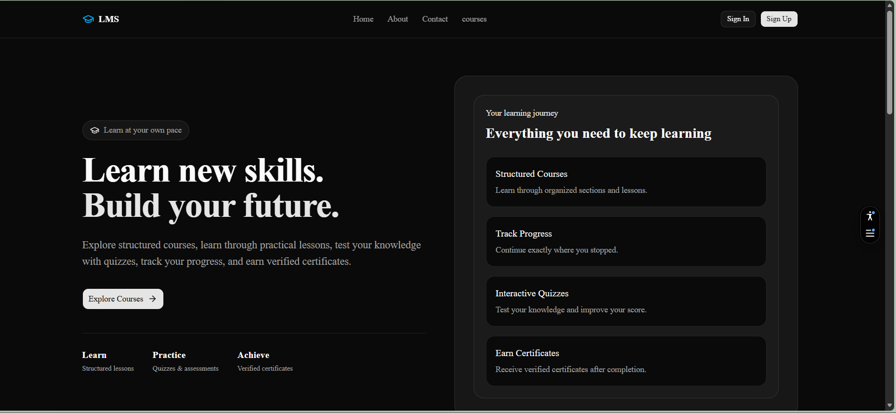
</p>

### Course Discovery & Course Details

<p align="center">
  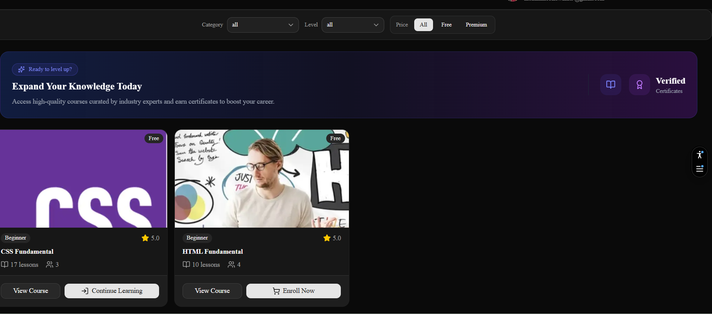
  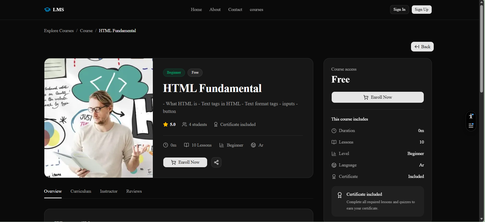
</p>

### Student Dashboard & Resume Learning

<p align="center">
  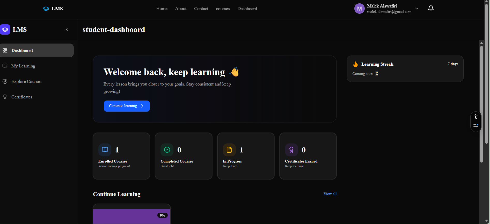
  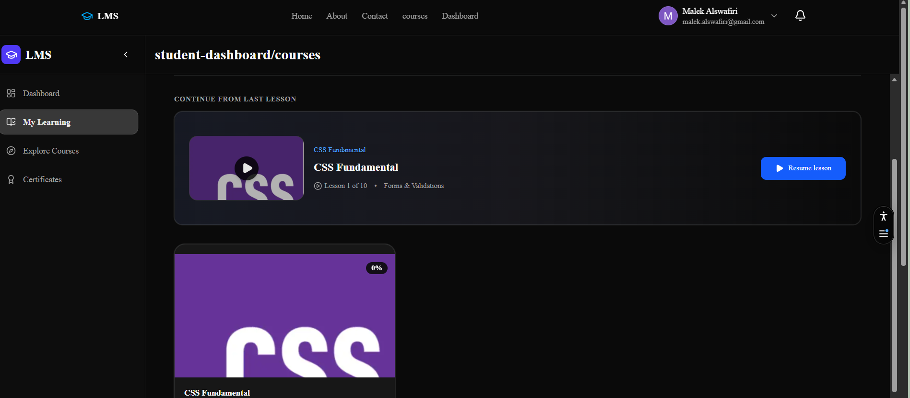
</p>

### Learning Workspace

<p align="center">
  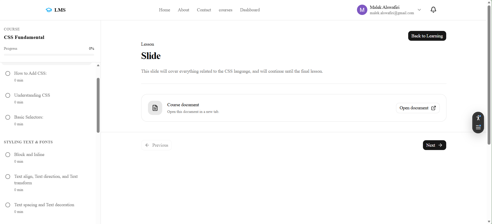
</p>

### Quiz System

<p align="center">
  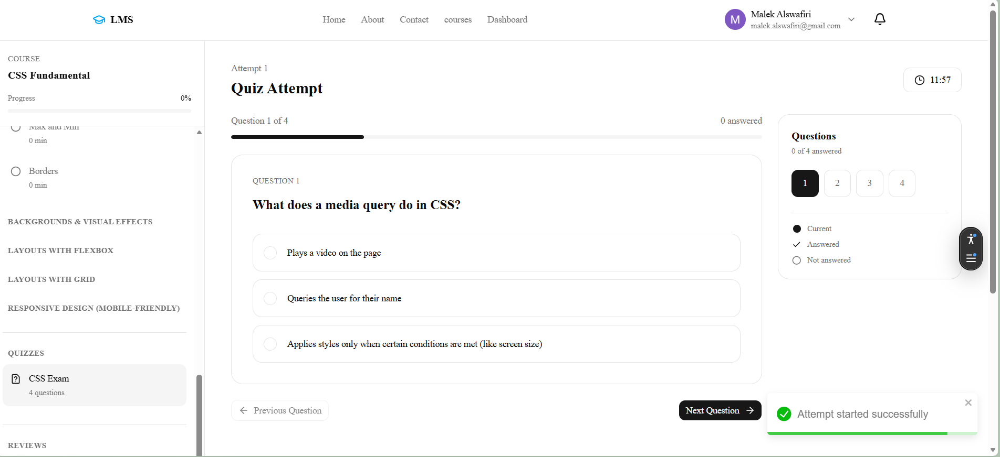
</p>

### Stripe Checkout & Payment Confirmation

<p align="center">
  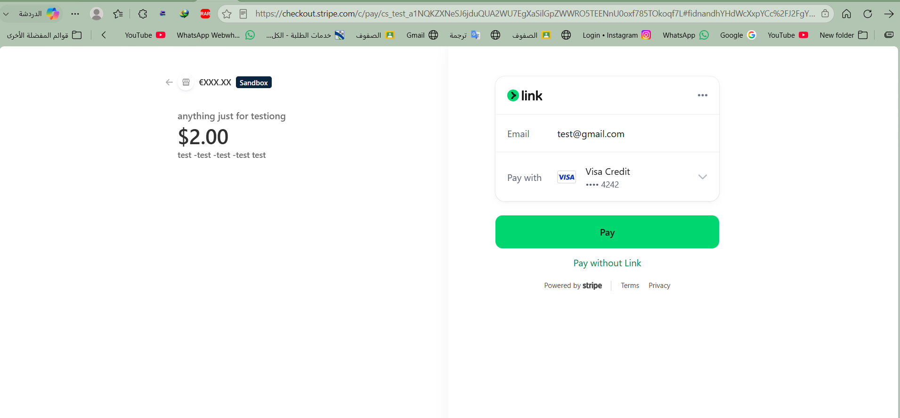
  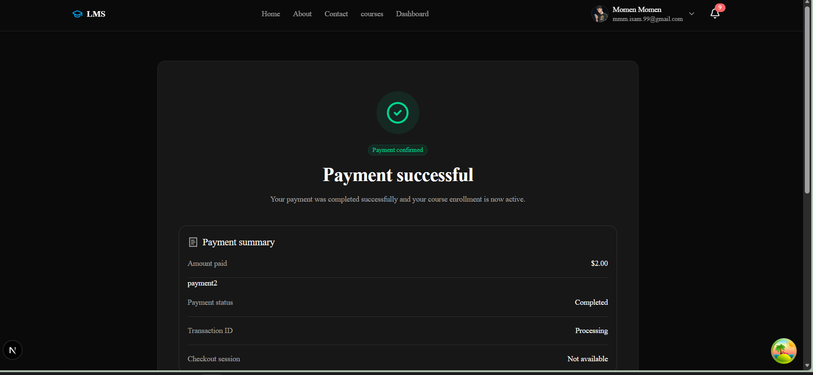
</p>

### Instructor & Admin Dashboards

<p align="center">
  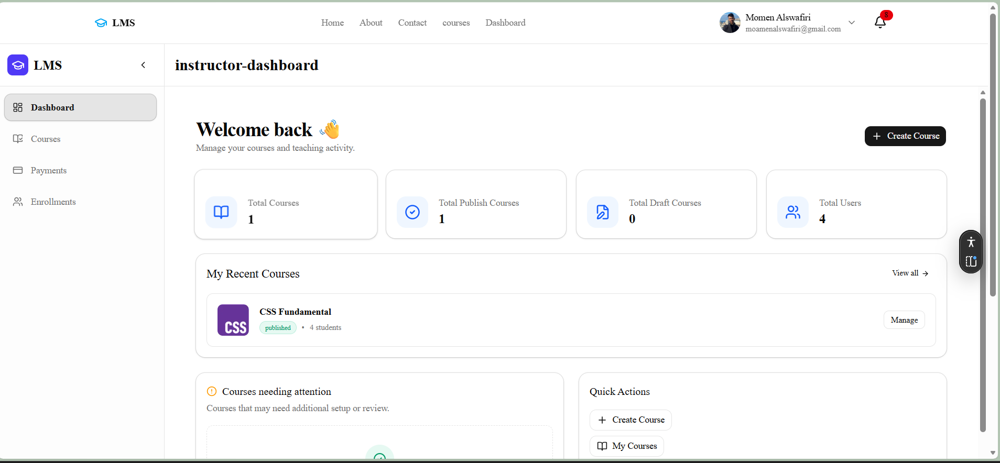
  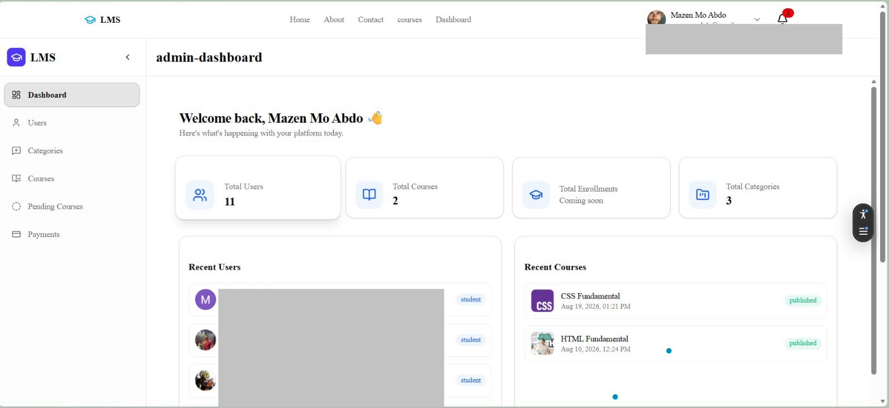
</p>

### Certificate & Public Verification

<p align="center">
  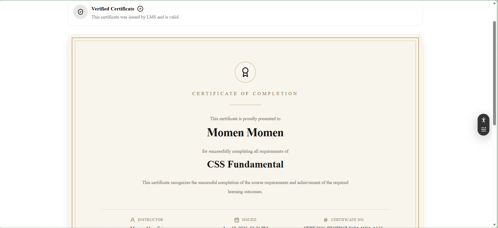
</p>

---

# 🚀 Core Product Capabilities

## 👨‍🎓 Student Experience

Students can:

- browse and filter courses
- view public course details
- enroll in free courses
- pay for premium courses through Stripe Checkout
- access a personal learning dashboard
- resume from the last saved learning position
- consume lesson media including:
  - video
  - audio
  - documents
  - external URLs
- track course progress
- take quizzes with:
  - countdown timers
  - multiple attempts
  - question navigation
  - saved answers
  - auto-submit on expiration
  - pass/fail results
  - earned marks
- submit course reviews when eligible
- view earned certificates
- share or print certificates
- open public certificate verification pages
- manage profile data
- receive in-app notifications

---

## 👨‍🏫 Instructor Experience

Instructors can:

- create and update courses
- manage draft and published course content
- submit courses for admin review
- organize courses into sections
- manage lessons
- attach lesson media
- create question banks
- create questions and answer choices
- mark correct choices
- create and manage quizzes
- configure:
  - duration
  - passing score
  - maximum attempts
  - marks
  - question bank
- view enrolled students
- view course certificates
- issue certificates
- delete certificates
- monitor course statistics from the instructor dashboard

---

## 🛡️ Admin Experience

Admins can:

- view platform-level statistics
- manage users
- filter and inspect users
- delete users
- manage categories
- manage courses
- inspect instructor courses
- view course enrollments
- review submitted courses
- approve pending courses
- reject pending courses

---

# 🧭 Learning Journey

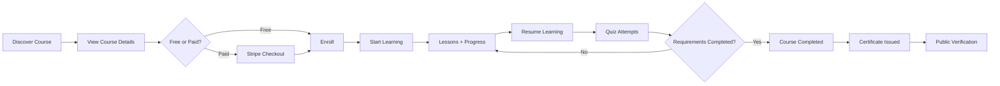

---

# 🧱 Frontend Architecture

The project uses a **feature-module architecture**.

```text
app/
├── (pages)/                    # App Router pages
├── _modules/                   # Domain-based feature modules
│   ├── auth/
│   ├── course/
│   ├── enrollment/
│   ├── payment/
│   ├── quiz/
│   ├── quiz-attempt/
│   ├── certificate/
│   ├── review/
│   ├── notifications/
│   ├── student-dashboard/
│   ├── instructor-dashboard/
│   └── admin-dashboard/
├── layout.tsx
└── globals.css

components/
├── guards/
├── inputs/
├── sharing/
├── skeletons/
└── ui/

providers/
utils/
types/
public/
└── readme-assets/
```

Most domain modules follow a layered structure similar to:

```text
feature/
├── dto/
├── entity/
├── hooks/
├── repo/
├── utils/
└── views/
```

A typical data flow is:

```text
Repository → React Query Hook → View
```

---

# 🌐 Production API Architecture

The frontend is deployed on **Vercel** while the backend runs separately.

Instead of allowing the browser to call the backend directly, production requests are routed through the frontend origin:

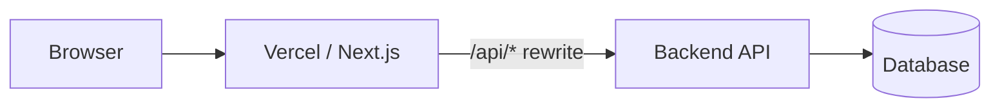

The rewrite is configured in `next.config.ts`:

```ts
async rewrites() {
  return [
    {
      source: "/api/:path*",
      destination: `${process.env.NEXT_PUBLIC_API_URL}/api/:path*`,
    },
  ];
}
```

This keeps browser API traffic on relative paths such as:

```text
/api/auth/login
/api/auth/refresh
/api/auth/csrf-token
/api/courses
/api/users/me
```

---

# 🔐 Authentication & Security

The frontend authentication flow is cookie-based from the browser's perspective.

Implemented security behavior includes:

- `withCredentials: true`
- JWT-based backend authentication
- access/refresh session handling
- centralized CSRF handling
- `X-CSRF-Token` injection for unsafe requests
- CSRF token caching in memory
- single-flight CSRF requests
- single-flight refresh requests
- one-time retry flags
- automatic refresh after eligible `401` responses
- automatic CSRF recovery after an invalid CSRF response
- login/register/logout session-state invalidation
- Google OAuth
- GitHub OAuth
- role-aware client guards
- Zod-based validation
- TypeScript strict mode

> Client guards improve UX, but backend authorization remains the actual security boundary.

---

# 🧩 Production Engineering Challenges

This section documents real production issues encountered during deployment and the fixes applied.

## 1. Stale Session / CSRF State

### Problem

A user could leave the application without explicitly pressing logout.

After the authentication session expired, stale session/CSRF cookies could remain in the browser. Reusing stale CSRF state could cause requests to fail with an invalid CSRF response.

### Resolution

The CSRF flow was updated so that:

- invalid cached CSRF state is cleared
- a fresh CSRF token can be requested
- the original request is retried once
- authentication mutations clear old in-memory CSRF state
- refresh operations clear CSRF state because session cookies may rotate

This allows the application to recover without requiring users to manually clear browser cookies.

---

## 2. Mobile & Private Browsing Authentication

### Problem

The frontend and backend were originally accessed from different sites:

```text
Frontend → Vercel
Backend  → Render
```

That meant authentication depended on cross-site cookies.

This worked in normal desktop browsing, but mobile browsers and private/incognito modes apply stricter third-party cookie rules, which caused authentication flows to fail.

### Resolution

All browser API traffic was moved behind the frontend origin:

```text
Browser
   ↓
Vercel /api/*
   ↓
Next.js Rewrite
   ↓
Backend API
```

This made the browser-side API flow same-origin.

---

## 3. Incomplete Proxy Migration

After introducing the API proxy, normal Axios requests were routed through `/api`, but some authentication requests still called the backend directly.

The remaining direct calls included:

- CSRF token requests
- refresh requests
- OAuth entry points

That created inconsistent cookie origins.

### Resolution

All authentication-related browser requests were migrated to relative `/api/...` routes so that they use the same proxy path as the rest of the application.

---

## 4. OAuth State Mismatch

After moving the OAuth callback through the frontend proxy, the OAuth flow temporarily failed with:

```text
Invalid OAuth state
```

The OAuth flow started on one origin while the callback completed through another.

### Resolution

Both the OAuth start and OAuth callback were routed through the same frontend `/api` origin.

Final flow:

```text
Browser
→ /api/auth/google
→ Backend
→ Google
→ /api/auth/google/callback
→ Backend
```

The same proxy strategy applies to GitHub OAuth entry points.

---

# 💳 Payments

Paid course enrollment is backend-driven and uses Stripe Checkout.

Flow:

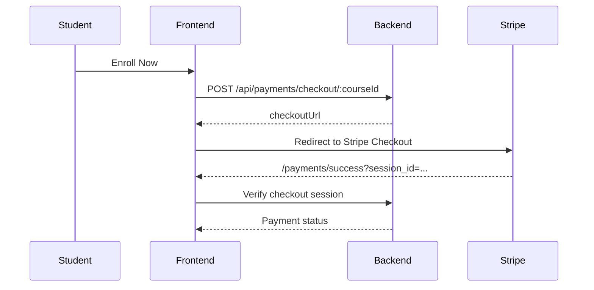

The payment success page supports:

- pending
- completed
- failed
- expired
- refunded

Pending payment verification is retried automatically.

---

# 🧠 Quiz System

The quiz experience includes:

- question banks
- reusable questions
- answer choices
- correct-choice configuration
- passing score
- marks
- maximum attempts
- duration
- start/resume attempt
- answer persistence
- countdown timer
- direct question navigation
- answered-question tracking
- automatic submission
- score calculation
- pass/fail state
- retry support
- perfect-score handling

Student attempt endpoints include:

```text
POST /api/quizzes/:quizId/attempts
GET  /api/quiz-attempts/:attemptId
PUT  /api/quiz-attempts/:attemptId/answers/:questionId
POST /api/quiz-attempts/:attemptId/submit
GET  /api/quizzes/:quizId/my-attempts
```

---

# 🏆 Certificates

Certificates are integrated into the learning flow.

Supported frontend capabilities include:

- view current user's certificates
- view certificate details
- public certificate verification
- share certificate
- clipboard fallback
- print certificate
- instructor certificate management
- certificate issue/delete operations

Public verification route:

```text
/certificates/verify/[id]
```

---

# ⭐ Reviews

Students can create reviews when:

- they are enrolled
- course progress reaches at least 50%
- eligibility rules are satisfied

Implemented review operations include:

- create
- list
- get by ID
- get current user's review
- update
- delete

---

# 🔔 Notifications

Authenticated users have a global notification center with:

- unread count
- paginated notifications
- unread notifications
- mark one as read
- mark all as read
- delete notification
- visual status types:
  - info
  - success
  - warning
  - error

---

# 🧰 Tech Stack

| Area | Technology |
|---|---|
| Framework | Next.js 16.2.10 |
| UI Runtime | React 19.2.4 |
| Language | TypeScript |
| Styling | Tailwind CSS 4 |
| Component System | shadcn/ui + Base UI |
| Server State | TanStack React Query |
| HTTP Client | Axios |
| Forms | React Hook Form |
| Validation | Zod |
| Theme | next-themes |
| Icons | Lucide React |
| Notifications UI | React Toastify |
| Backend | NestJS |
| Database | PostgreSQL |
| ORM | Prisma |
| Payments | Stripe |
| Deployment | Vercel + Render |
| Package Manager | pnpm |

---

# ⚙️ Getting Started

## Prerequisites

Make sure you have:

- Node.js
- pnpm
- access to the LMS backend API

## Install dependencies

```bash
pnpm install
```

## Environment variables

Create a local `.env` file:

```env
NEXT_PUBLIC_API_URL=http://localhost:5000
```

The variable should point to the backend origin **without** `/api` at the end.

## Start development

```bash
pnpm dev
```

The frontend will normally run on:

```text
http://localhost:3000
```

API calls are sent to:

```text
http://localhost:3000/api/*
```

and rewritten to the configured backend.

---

# 📜 Available Scripts

| Command | Purpose |
|---|---|
| `pnpm dev` | Start the development server |
| `pnpm build` | Build the production application |
| `pnpm start` | Start the production server |
| `pnpm lint` | Run ESLint |

---

# 🛣️ Important Routes

### Public

```text
/
 /about
 /contact
 /courses
 /courses/[id]
 /certificates/verify/[id]
 /privacy
 /terms
```

### Authentication

```text
/login
/register
/forgot-password
/reset-password
/verify-email
/verification-email
/check-your-email
/oauth/success
```

### Student

```text
/student-dashboard
/student-dashboard/courses
/student-dashboard/explore-courses
/student-dashboard/certificates
/courses/[id]/learning
```

### Instructor

```text
/instructor-dashboard
/instructor-dashboard/courses
/instructor-dashboard/courses/create
/instructor-dashboard/courses/[id]/details
/instructor-dashboard/courses/[id]/sections
/instructor-dashboard/courses/[id]/students
/instructor-dashboard/courses/[id]/certificates
/instructor-dashboard/courses/[id]/questions-bank-table
/instructor-dashboard/courses/[id]/quizzes
```

### Admin

```text
/admin-dashboard
/admin-dashboard/users
/admin-dashboard/categories
/admin-dashboard/courses
/admin-dashboard/pending-courses
```

---

# 📌 Current Scope Notes

The following items are intentionally **not presented as completed features**:

- Learning Streak is currently marked as coming soon.
- No frontend automated test suite is currently configured.
- Admin and instructor payment-management pages are not currently implemented.
- The certificate “Download PDF” action currently relies on browser print behavior.
- Some sidebar links exist ahead of their corresponding pages.
- Some public course tab content is still placeholder content.

These items are kept explicit so the README reflects the actual repository state.

---

# 📁 Screenshot Assets

README screenshots are stored in:

```text
public/readme-assets/
```

Current assets include:

```text
landing-page.png
course-discovery.png
course-details.png
student-dashboard.png
resume-learning.png
learning-experience.png
quiz-system.png
stripe-checkout.png
payment-successful.png
instructor-dashboard.png
admin-dashboard.png
certificate.png
```

---

<div align="center">

## Built as a complete learning workflow — from discovery to verified completion.

</div>
